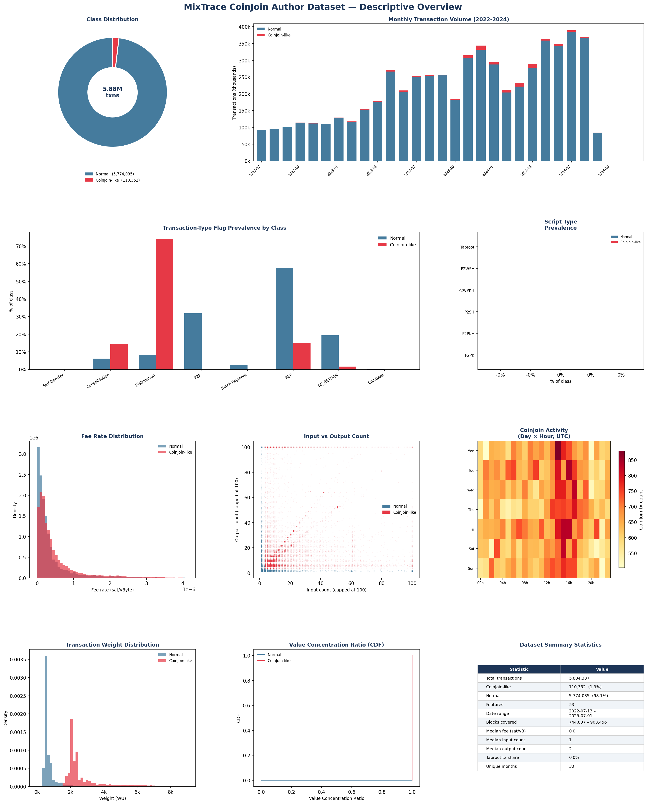

# Bitcoin Blockchain Transaction Dataset for Wallet Address Profiling and Behavioral Analysis (Parquet Format)

[](https://doi.org/10.21227/bxmt-mn56)
[](https://ieee-dataport.org/documents/bitcoin-blockchain-transaction-dataset-wallet-address-profiling-and-behavioral-analysis)
[]()

---

## Dataset

> **IEEE Dataport DOI:** [10.21227/bxmt-mn56](https://doi.org/10.21227/bxmt-mn56)

This repository contains the documentation, visualization, and usage scripts for the **Bitcoin Blockchain Transaction Dataset** published on IEEE Dataport. The dataset itself (`Dataset.parquet`, ~1.8 GB) is available for download directly from IEEE Dataport via the DOI above.

| Property       | Value                                      |
|----------------|--------------------------------------------|
| Transactions   | 5,884,387                                  |
| Features       | 53 per transaction                         |
| Date Range     | July 2022 – July 2025                      |
| Blocks         | 744,837 – 903,456                          |
| Format         | Apache Parquet (Snappy-compressed)         |
| Label          | `is_coinjoin_like` (1.88% positive class)  |
| DOI            | 10.21227/bxmt-mn56                         |

---

## Files in This Repository

| File | Description |
|------|-------------|
| `DATASET_DOCUMENTATION.md` | Full data dictionary — all 53 columns with types and descriptions |
| `DATASET_DOCUMENTATION.docx` | Formatted Word version of the documentation |
| `DATASET_DOCUMENTATION.pdf` | PDF version of the documentation |
| `IEEE_DATAPORT_INSTRUCTIONS.md` | Usage instructions and code examples |
| `dataset_visualization.png` | 10-panel descriptive overview figure |
| `visualize_dataset.py` | Python script to reproduce the visualization |

---

## Quick Start

```python
# 1. Download Dataset.parquet from IEEE Dataport: https://doi.org/10.21227/bxmt-mn56
# 2. Install dependencies
pip install pandas pyarrow matplotlib scikit-learn numpy

# 3. Load
import pandas as pd
df = pd.read_parquet("Dataset.parquet")
print(df.shape)                                  # (5884387, 53)
print(df["is_coinjoin_like"].value_counts())
```

---

## Dataset Overview



---

## Citation

If you use this dataset, please cite:

```bibtex
@data{bxmt-mn56-26,
  author    = {Korde, Sagar and Shekokar, Narendra and Siddavatam, Irfan},
  publisher = {IEEE Dataport},
  title     = {Bitcoin Blockchain Transaction Dataset for Wallet Address Profiling and Behavioral Analysis (Parquet Format)},
  year      = {2026},
  doi       = {10.21227/bxmt-mn56},
  url       = {https://doi.org/10.21227/bxmt-mn56}
}
```

**APA:**
Korde, S., Shekokar, N., & Siddavatam, I. (2026). *Bitcoin Blockchain Transaction Dataset for Wallet Address Profiling and Behavioral Analysis (Parquet Format)*. IEEE Dataport. https://doi.org/10.21227/bxmt-mn56

**Associated paper:**
Korde, S. et al. (2026). *HyGAP: A Multi-Layered Hybrid Framework for Behavioral Bitcoin Wallet Profiling and Unsupervised Anomaly Detection.* ICCUBEA 2026, Paper ID 1504, Track: Blockchain And Cyber Security.

---

## Authors

- **Sagar Korde** — Dwarkadas J. Sanghvi College of Engineering & K. J. Somaiya School of Engineering, Mumbai, India
- **Narendra Shekokar** — Dwarkadas J. Sanghvi College of Engineering, Mumbai, India
- **Irfan Siddavatam** — K. J. Somaiya School of Engineering, Mumbai, India

📧 [sagarkorde04@gmail.com](mailto:sagarkorde04@gmail.com)

---

## License

Released for academic and non-commercial research use. Redistribution with attribution is permitted. Commercial use requires explicit written consent from the authors.
